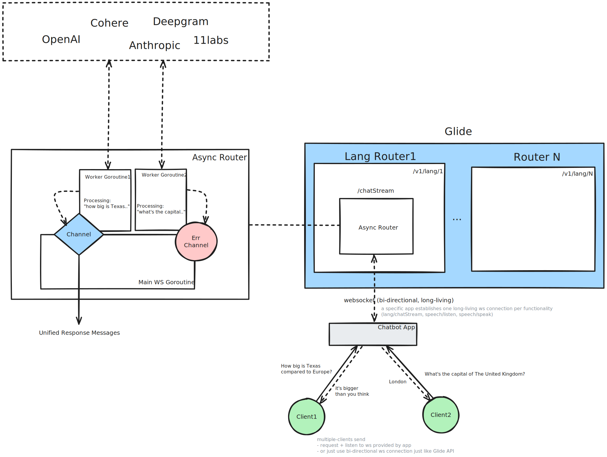

# The Async API

## Abstract

Glide strives to adopt more complex workflows like streaming text generation, speech transcribers and synthesizers. 
These types of workflows require us to have async workflows in Glide.

At the same time, we want to have all async workflows as similar as possible, 
so it's easier for our users to work with them, and it's easier to Glide maintainers to support them.

## Motivation

Currently, Glide provides the unified chat & soon embedding APIs that are essentially sync request-response workflows.

### Requirements

- R1: It **MUST** be possible to use the proposed approach to implement streaming text generation & speech workflows
- R2: The async API **SHOULD** be as unified as possible
- R3: The proposed workflow **SHOULD** account for challenges of stateful connections in cloud environments
- R4: The proposed workflow **SHOULD** account for a multi-instance Glide setups (like a typical deployment in K8s)

## Design

### Use Websocket Protocol

We are going to use websocket protocol to power all Glide's async API.
Websocket is a bidirectional stateful long-living protocol that is normally used 
to communicate between a few parties by message passing.

Every instance of a specific application establishes one long-lived websocket connection and 
use it to trigger async functionality of the corresponding router. 
This will ensure low latency communication between specific applications and Glide (as we eliminate overhead related to connection handshakes, especially, during TLS connections).

### Async Endpoints

Just like with our sync API, async API is configured on a specific router level like:

- `/v1/language/default-lang-router/chat` - the unified chat API (the existing endpoint)
- `/v1/language/default-lang-router/chatStream` - an async websocket endpoint (a new one)
- `/v1/speech/default-speech-router/speak` - an async websocket endpoint (a new one)
- `/v1/speech/default-speech-router/listen` - an async websocket endpoint (a new one)

### Async Routing

The key points:

- Specific applications will need to establish and maintain one websocket connection per functionality (e.g. streaming text generation)
- The existing routing workflow needs to embrace the async nature of the API. We likely will need to spin a routing logic in goroutines (aka control routines) that serve each client connection (e.g. instances of specific apps). 
  Since websocket connection has to have one writer we will use the control goroutine to send response messages. Routers can leave response messages in a response channel.
- Then, when we receive a new request message (e.g. "answer this question in a streaming manner"), we will start a new goroutine (aka request goroutine) to process that specific request.
- The request goroutine will have access to the response channel. These channels could be the same for all request goroutines for the given connection (or control goroutine that has spawn them).
- The response channel is where request goroutines put all content chunks of the corresponding responses or error messages. The control goroutine will then be sending them back to the applications.
- Under the hood, the request goroutines will call routing logic that hits providers/model tracking wrappers to generate content chunk streams.
- The actual stream is abstracted away behind Stream interface that can have three methods: `Open()`, `Recv()`, `Close()`. These methods seem to be sufficient to seamlessly plug into the stream and do health/latency tracking.
- Since there is only one connection used for all requests, we will need to distinguish between response chunks, so application will be able to show/process them for their users.

### The Message Structure

Since application clients connect to well-scoped endpoints (e.g. `chatStream`), messages are going to be well-scoped as well.

So each functionality will possibly have messages with different fields (that we have to define in follow-up GEPs), 
but there are also some fields that make sense to have for all messages:

- `request_id` to help applications to match request with the corresponding response chunks
- `metadata` - which is a key-value map (e.g. `map[string]string`) to help applications to pass some additional data like `user_id`, etc.

### Async Speech API

Speech API is somewhat more complex than text generation as we work on the stream of voice there:
- TTS - the response is a voice stream
- STT - the request is a voice stream

Nevertheless, the async routing workflow should be applicable here, too.
We will just need to break the incoming stream into chunks and propagate it forward and back to providers/app clients.

### Rollouts and Stateful Connections

Everything stateful is a challenge when dealing with it in cloud setups that is intended to have a few replicas of any service.
Specifically, websocket connections are long-lived. 

This means that in order to gracefully shutdown, Glide will have:

- stop accepting any new connections (K8s does this automatically once a pod goes into the terminating state)
- to understand which connections are idle and close them. Application clients will have to handle this and do reconnection. The next time they reconnect they will end up connecting to other instance of Glide
- wait until busy requests are finished. Close those remaining connections.
- Shutdown

## Alternatives Considered

- **The single bidirectional websocket endpoint**. 

## Future Work

- Define the specific chat stream messages and fallback strategies ([GEP006](https://github.com/EinStack/geps/pull/12))
- Define the specific messages and fallback strategies for speech transcriber API
- Define the specific messages and fallback strategies for speech synthesizer API
